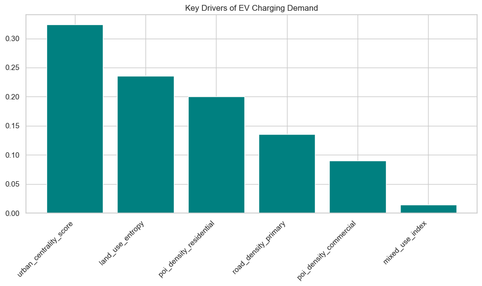
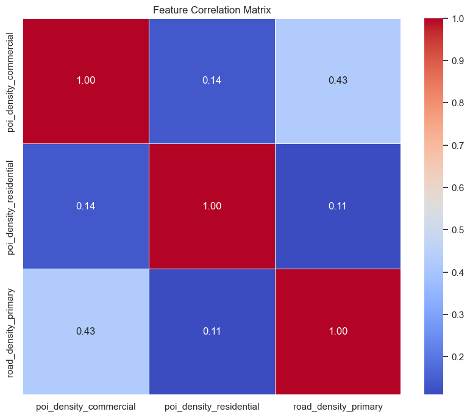

# Pre-Processing and EDA

Once the raw data is acquired, it must be rigorously processed to ensure suitability for the machine learning pipeline. This phase includes cleaning data, handling missing values, encoding categorical variables, and analyzing feature distributions. Given the geospatial nature of our dataset, this step was crucial for ensuring that our grid-based predictions were accurate and not biased by noise.

## Dataset Collection

Our dataset was constructed by aggregating multiple geospatial data sources to create a unified "grid" of the target urban area. The primary data sources included:

* **OpenStreetMap (OSM):** For road network data (primary, secondary, tertiary roads) and Points of Interest (POIs) such as commercial centers, residential complexes, and transport hubs.
* **Demographic Data:** Population density estimates mapped to grid cells.
* **Traffic Data:** Historical traffic volume estimates for major intersections.

The study area was divided into hexagonal/square grid cells, with each row in the dataset representing a specific geospatial location (identified by `grid_id`, `latitude`, `longitude`).

## Data Pre-processing

Data pre-processing was an iterative process involving several key challenges and solutions.

### 1. Handling Missing Values
We encountered missing values primarily in peripheral grid cells where sensor data or POI density was sparse.

* **Analysis:** A pattern analysis showed that missing values were not random (MNAR); they clustered in low-density residential areas or open spaces.
* **Solution:** We employed **Zero Imputation** for POI counts (assuming null meant zero presence) and **Median Imputation** for continuous variables like `traffic_volume` to avoid skewing the distribution with outliers.

### 2. Encoding and Data Types (Key Challenge)
A significant challenge encountered during the pipeline development was the presence of non-numeric data types in the training set.

* **Issue:** The XGBoost algorithm threw specific `ValueError` and `AttributeError` exceptions when encountering columns of type `object` (e.g., `grid_type`, `zone_name`).
* **Solution:** We implemented a strict filtering process to drop non-informative string columns. Categorical variables with predictive power were One-Hot Encoded, while purely descriptive text columns were removed from the input matrix `X_inference` to resolve `DataFrame.dtypes` conflicts.

### 3. Scaling
While tree-based models like XGBoost are generally robust to unscaled data, we applied **Min-Max Scaling** to features like `population_density` and `traffic_volume`. This ensured that features with large raw values did not dominate the initial tree-building splits, although for the final XGBoost implementation, this step was less critical than for linear models.

### 4. Outliers
The dataset contained significant outliers, particularly in the `poi_density_commercial` feature (Central Business Districts).

* **Decision:** We chose **not** to remove these outliers. In the context of EV charging station placement, these "outliers" represent high-value targets (hotspots). Capping or removing them would have eliminated the very locations we aimed to identify.

## Exploratory Data Analysis and Visualisations

We conducted EDA to understand the underlying structure of the urban environment and validate our feature engineering.

### Data Visualization
We utilized histograms and box plots to analyze feature distributions.

* **Observation:** Most density features (e.g., `poi_density_residential`) followed a Power Law distribution (right-skewed), indicating that a small number of grid cells contain the majority of urban activity.
* **Action:** This confirmed the need for a non-linear model like XGBoost, which handles skewed distributions better than standard regression.

{#fig-dist-plot width=85%}

### Statistical Analysis
We computed a **Correlation Matrix** to identify relationships between variables.

* **Findings:** Strong multicollinearity was observed between `road_density_primary` and `poi_density_commercial`.
* **Impact:** While collinearity does not ruin prediction accuracy in boosted trees, it complicates feature importance interpretation. We noted this when analyzing the model's "Feature Importance" output later.

{#fig-heatmap width=85%}

### Feature Selection and Dimensionality Reduction
We faced a "Feature Mismatch" issue where the inference dataset contained ~40 columns while the trained model expected only 6 specific features. This forced a rigorous feature selection process.

Using **Recursive Feature Elimination (RFE)** and domain knowledge, we narrowed our model down to the 6 most impactful predictors:

1.  `land_use_entropy` (Measure of mixed-use development)
2.  `poi_density_commercial`
3.  `poi_density_residential`
4.  `road_density_primary`
5.  `urban_centrality_score`
6.  `mixed_use_index`

This dimensionality reduction not only improved model training speed but also prevented the "Curse of Dimensionality," ensuring the model focused on signal rather than noise.

## Other Related Sections (Optional)

### Addressing Data Leakage
We ensured that the target variable (simulated historical demand) was strictly separated from the training features. Columns representing future knowledge (e.g., `future_zoning_plans`) were excluded to prevent data leakage.

### Geographic Clustering
Although we did not use clustering algorithms (like K-Means) for feature generation, visual inspection of the High Demand predictions showed clear geographic clusters. These clusters aligned with major arterial roads and commercial hubs, validating the spatial coherence of our data.
