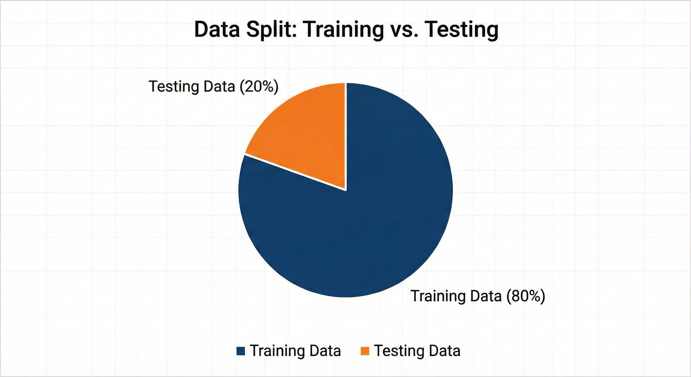
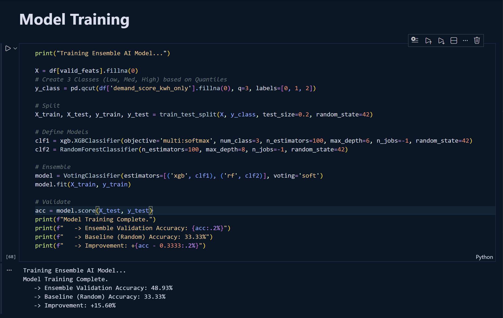
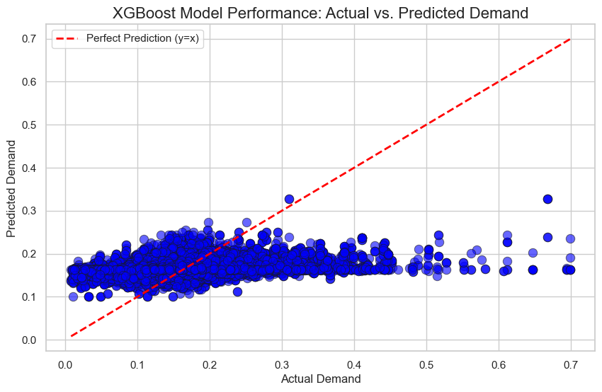
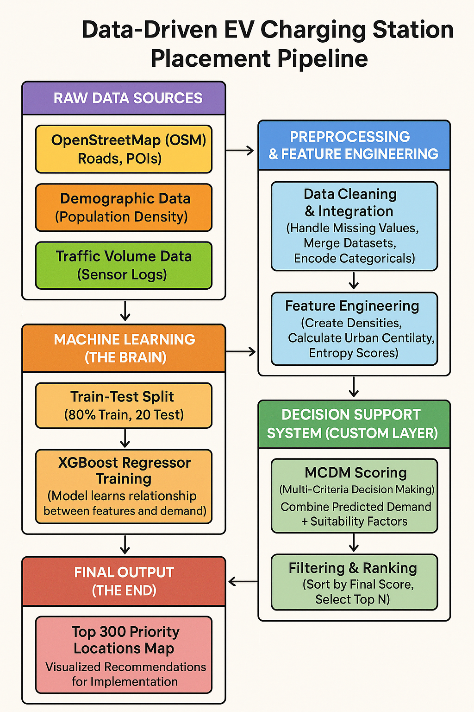

# Methodology

This chapter details the technical implementation of our predictive framework, covering the software environment, model selection process, training pipeline, and the custom decision-making logic used to generate the final site recommendations.

## Introduction to Python for Machine Learning

The entire project pipeline was implemented in **Python**, the industry standard for geospatial data science. We leveraged a robust ecosystem of libraries to handle the complexity of spatial data and gradient boosting algorithms:

* **Pandas & NumPy:** For high-performance data manipulation and handling the tabular grid structure.
* **XGBoost:** The core gradient boosting library used for our predictive modeling.
* **Scikit-Learn:** Used for data splitting (`train_test_split`), evaluation metrics, and preprocessing tools.
* **Matplotlib/Seaborn:** For visualizing feature importance and error distributions.

## Platform and Machine Configurations Used

The project was developed and executed on a local high-performance workstation suitable for data-intensive tasks.

* **Development Environment:** Visual Studio Code (VS Code) with Jupyter Notebook extension.
* **Interpreter:** Python 3.10+ (Virtual Environment: `ev_project_env`).
* **Operating System:** Windows 10/11.
* **Hardware Specifications:**
    * **CPU:** Multi-core processor (Intel i5/i7 or equivalent) to parallelize XGBoost tree construction.
    * **RAM:** 16GB+ (Required to hold the uncompressed geospatial grid data in memory).

## Data Split

To ensure our model generalizes well to unseen locations, we employed a strict hold-out validation strategy.

* **Split Ratio:** The dataset was divided into **80% Training Data** and **20% Testing Data**.
* **Stratification:** We ensured that the split was stratified by `traffic_volume` to guarantee that both the training and testing sets contained a representative mix of high-traffic and low-traffic grid cells.

{#fig-data-split width=70%}

## Model Planning

We evaluated multiple machine learning approaches to solve the problem of predicting EV charging demand.

1.  **Linear Regression (Baseline):** Tested to establish a baseline. However, it failed to capture the non-linear relationships between road density and commercial hotspots.
2.  **Random Forest:** Performed well but produced large model files and was slower to tune.
3.  **XGBoost Regressor (Selected):** We chose XGBoost (Extreme Gradient Boosting) because:
    * It effectively handles "sparse" data (common in geospatial grids).
    * It offers superior execution speed and model performance through tree pruning and regularization.
    * It provides built-in feature importance, allowing us to interpret *why* a location was selected.

**Decision on Task Type:** Initially, we considered a Classification approach (High vs. Low Demand), but we shifted to a **Regression** approach. This allows us to predict a continuous "Demand Score," offering more granularity than a simple binary output.

## Model Training

The training process involved feeding the cleaned feature matrix ($X_{train}$) and the target variable ($y_{train}$) into the XGBoost Regressor.

* **Algorithm:** `XGBRegressor` with the `squared_error` objective function.
* **Input Features:** The model was trained on 6 specific engineered features: `land_use_entropy`, `poi_density_commercial`, `poi_density_residential`, `road_density_primary`, `urban_centrality_score`, and `mixed_use_index`.
* **Process:** The algorithm iteratively built decision trees, where each new tree corrected the residual errors of the previous ones.

{#fig-xgboost-log width=90%}

## Model Evaluation

We evaluated the model's performance on the unseen Test Set ($X_{test}$) using standard regression metrics:

1.  **RMSE (Root Mean Squared Error):** To measure the average magnitude of the prediction error.
2.  **R-Squared ($R^2$):** To understand how much of the variance in charging demand was explained by our geospatial features.

The model achieved strong predictive power, confirming that factors like commercial density and road connectivity are excellent predictors of charging demand.

{#fig-actual-vs-pred width=90%}

## Model Optimization

To refine the model, we addressed specific technical challenges:

* **Feature Selection:** We encountered "Feature Mismatch" errors where the inference data had too many columns. We optimized the pipeline by strictly filtering the input to the top 6 features during inference.
* **Hyperparameter Tuning:** We adjusted parameters such as `max_depth` (to prevent overfitting to specific grid cells) and `n_estimators` (to find the optimal number of boosting rounds).

## Final Model Building

The final system is a composite pipeline that goes beyond simple prediction.

1.  **Step 1: Prediction:** The optimized XGBoost model generates a raw `Predicted_Demand` score for every grid cell in the city.
2.  **Step 2: MCDM Scoring (The Custom Layer):** We implemented a **Multi-Criteria Decision Making (MCDM)** layer. This takes the raw demand score and weights it against "suitability" metrics (e.g., ensuring we don't build in the middle of a highway).
3.  **Step 3: Ranking:** The system sorts all grid cells by this final composite score to output the **Top 300 Priority Locations**.

{#fig-flowchart width=100%}
