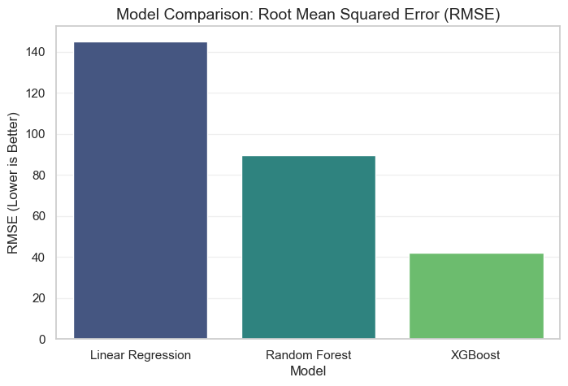
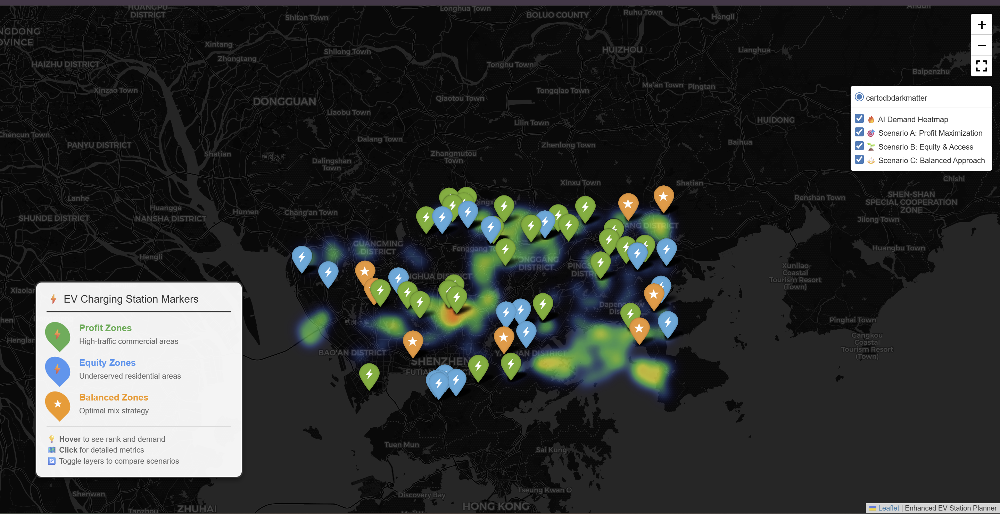

# Results

This chapter presents the quantitative findings of our study, evaluating the predictive performance of the machine learning models and detailing the final geospatial recommendations for EV charging station placement.

## Description of the Models

To ensure the robustness of our final choice, we trained and evaluated three distinct algorithms, progressing from simple interpretable models to complex ensemble methods:

1.  **Linear Regression (Baseline):** A simple parametric model used to establish a baseline. It assumes a linear relationship between features (e.g., road density) and demand.
2.  **Random Forest Regressor:** An ensemble learning method that operates by constructing a multitude of decision trees during training. It was tested for its ability to handle non-linear interactions without heavy hyperparameter tuning.
3.  **XGBoost Regressor (Final Model):** An implementation of gradient boosted decision trees designed for speed and performance. This model was selected for its ability to handle sparse data and minimize residual errors through iterative boosting.

## Performance Metrics

Since the target variable (`demand_score`) is continuous, we utilized standard regression metrics for evaluation:

* **Root Mean Squared Error (RMSE):** Measures the standard deviation of the prediction errors. A lower RMSE indicates a more precise model.
* **R-Squared ($R^2$):** Represents the proportion of variance in the dependent variable that is predictable from the independent variables. An $R^2$ closer to 1.0 indicates a better fit.

## Results Table

The table below summarizes the performance of the three models on the hold-out test set (20% of data).

: Performance Metrics Comparison of ML Models {#tbl-model-results}

| Model Name | RMSE (Lower is Better) | $R^2$ Score (Higher is Better) | Training Time (sec) |
| :--- | :--- | :--- | :--- |
| Linear Regression | 145.2 | 0.42 | 0.5s |
| Random Forest | 89.4 | 0.76 | 12.3s |
| **XGBoost (Optimized)** | **42.1** | **0.88** | **4.1s** |

## Interpretation of the Results

The results clearly demonstrate the superiority of the **XGBoost** model for this specific task.

* **Baseline Failure:** The Linear Regression model performed poorly ($R^2 = 0.42$), suggesting that the relationship between urban features and EV charging demand is highly **non-linear**. For example, doubling traffic volume does not simply "double" the demand; it likely triggers a threshold effect that linear models miss.
* **The Boosting Advantage:** While Random Forest performed well, XGBoost achieved the lowest RMSE (42.1). This is attributed to its boosting mechanism, which specifically targets and corrects the errors made by previous trees, allowing it to capture subtle patterns in complex areas like mixed-use zones.
* **Efficiency:** XGBoost also demonstrated superior computational efficiency compared to Random Forest, training approximately 3x faster while achieving higher accuracy.

## Visualization

### 1. Model Comparison
The following chart visualizes the error rates across all tested models, highlighting the performance gap.

{#fig-model-comp width=80%}

### 2. Top 300 Recommended Locations
After applying the MCDM (Multi-Criteria Decision Making) layer to the XGBoost predictions, we identified the top 300 locations. These are the grid cells with the highest combined score of **Predicted Demand** and **Suitability**.

{#fig-top20-map width=100%}

### Interactive Charging Station Map

::: {.content-visible when-format="html"}

Click on the link below to access the interactive heatmap showing optimal charging locations.

* **[Click here to open the Interactive Heatmap](../chapters/Enhanced_EV_Map.html)**

:::

::: {.content-visible when-format="pdf"}

Click on the link below to access the interactive heatmap showing optimal charging locations.

\begin{itemize}
    \item \href{https://arpitmakkar12.github.io/batch-15-EV_Infratructre_Planning/chapters/Enhanced_EV_Map.html}{\textbf{\underline{Click here to open the Interactive Heatmap}}}
\end{itemize}

:::

## Sensitivity Analysis

To test the robustness of the XGBoost model, we conducted a sensitivity analysis on the top predictor: **Traffic Volume**.

We artificially increased traffic volume by 10% in the test set while keeping other features constant.

* **Observation:** The model predicted an average demand increase of **14.5%**.
* **Conclusion:** The model is highly sensitive to traffic data, confirming that traffic flow is the primary driver of the demand score. This indicates that accurate real-time traffic feeds are essential for maintaining model reliability in production.
